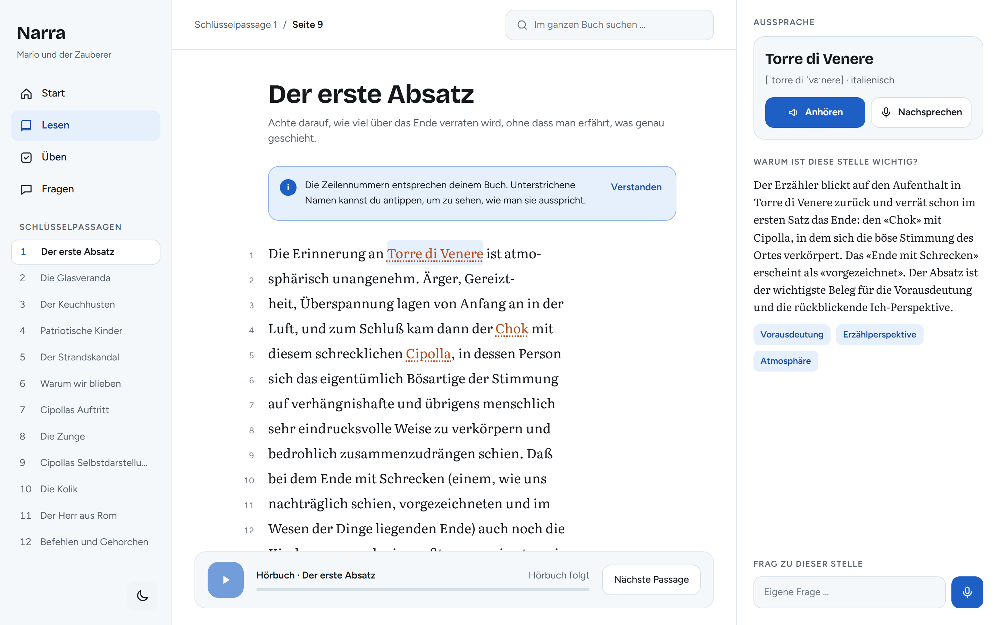
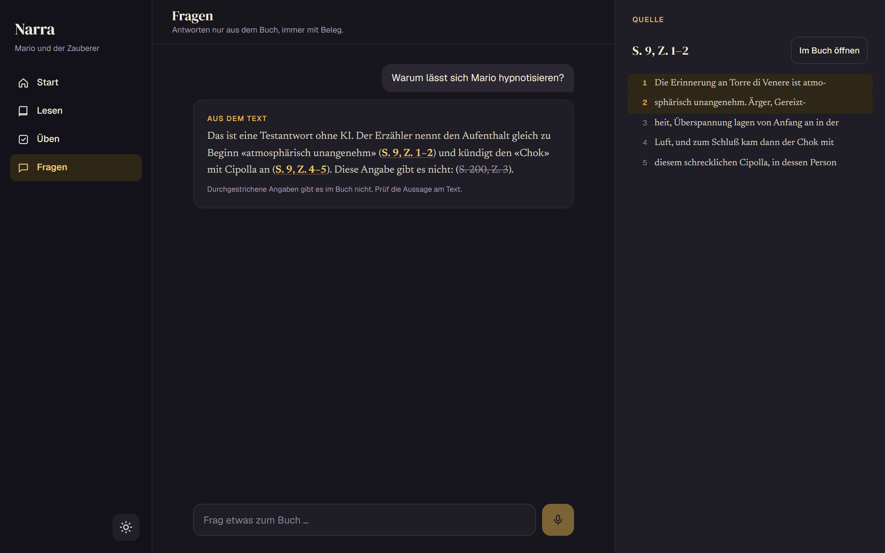
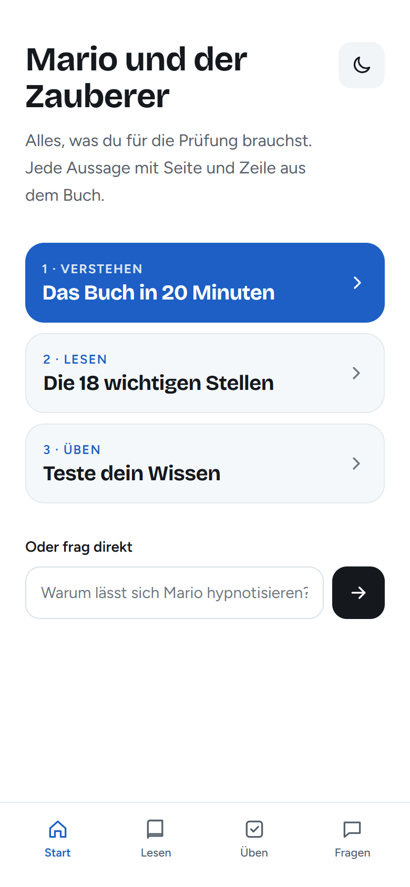
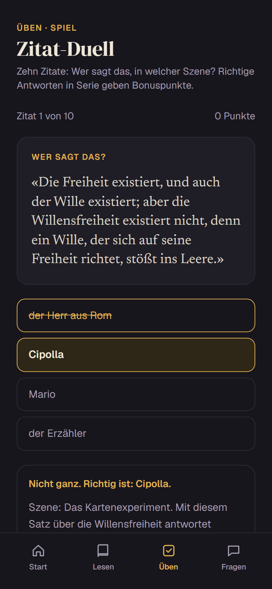
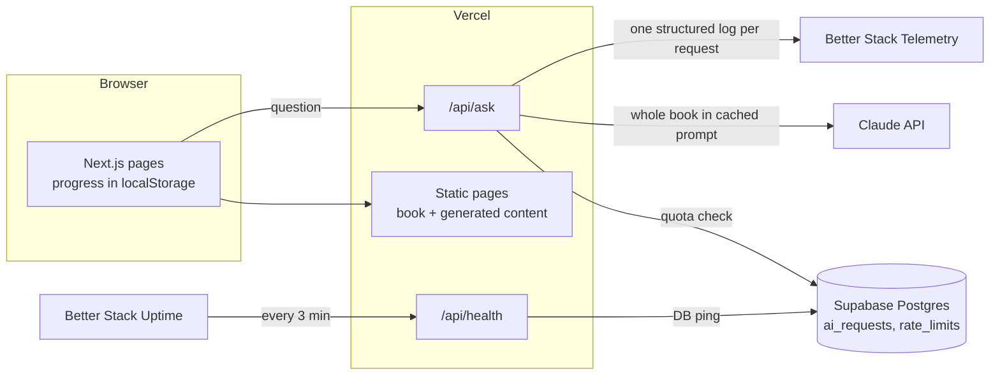

# Narra

[](https://github.com/SuterGabriel/Narra/actions/workflows/ci.yml)

A study companion for Thomas Mann's novella *Mario und der Zauberer*. Students get to exam level without reading the whole book: a 20-minute overview, the 18 passages that matter, practice games, and answers to their own questions. **Every statement points to a page and line of the Fischer paperback**, and the app checks those references against the text before showing them.

**Live:** [narra-nine.vercel.app](https://narra-nine.vercel.app) · one link for a whole class, no account, free.



| Questions with verified citations | Start page | Quote duel |
|---|---|---|
|  |  |  |

*The questions screenshot uses the local mock mode; the struck-through "S. 200" shows how invented references are caught.*

## What it does

- **A start page that needs no explanation:** one sentence, three numbered steps (understand, read, practise) and a question box. No onboarding, no tour: after trying a feature-heavy start page, a spotlight tour and a questionnaire, the simplest version tested best. Two one-time hints explain what is not obvious (tappable names, clickable citations).
- **Overview:** plot in eight steps, 13 characters, 9 motifs, the narrator and the historical context, each claim linked to the text.
- **Key passages:** 18 exam-relevant passages (about 25 pages, 45 minutes), each with a reading focus and a note on why it matters.
- **The whole book:** page-by-page reader with the original line breaks, full-text search that works across hyphenated line breaks, and deep links like `/buch/42?z=17-19` that highlight the cited lines.
- **Questions:** ask anything about the book. The answer streams in, every "S. 42, Z. 17" becomes a link, and the cited lines open next to the answer.
- **Practice:** 60 quiz questions (also per reading section), 60 flashcards with Anki export, a daily five-question quiz with a streak, a timed mock exam with results by topic, a quote duel, and a pronunciation list of 104 Italian and French names and phrases.
- **Study plan (under Üben):** a small piece each day for 1, 2 or 3 weeks until the exam. Progress stays in the browser.

## Architecture



- **Static first.** The book, the overview, passages, quiz, flashcards and quotes are JSON in the repo and prerendered (136 pages). They cost nothing per visit and keep working if the AI budget for the day is used up.
- **One live AI route.** Only free-form questions call a model. Voice features (ElevenLabs) are next and will follow the same pattern: generate once and cache what can be cached, meter what can't.

## Decisions

**No RAG.** The novella is about 114,000 characters. It fits in the context window many times over, so the whole text goes into the system prompt with a one-hour prompt cache. Retrieval would add chunking, embeddings and a vector store, and every retrieval miss would become a wrong or missing citation. With the full text, the model sees exact page and line numbers for every sentence.

**Citations are verified, not trusted.** `src/lib/citations.ts` resolves a reference to its lines, rejoins words split by line-end hyphens, and checks that a quote really occurs there. It runs in three places:
- `npm run check:content` verifies all 413 citations in the generated content (in CI on every push).
- `/api/ask` checks every reference in a model answer; the UI strikes out references that don't exist.
- The quote and passage data were generated against the same rules.

**How the text was captured.** The scan came from an iPhone and its embedded text layer was unusable (every glyph mapped to the same placeholder). Pages were transcribed from images, line by line, keeping the 1930 spelling (*daß*, *Chok*) and the printed hyphenation so that line numbers match the book. Quality checks:
- structural checks on all 99 pages (continuous page and line numbers, no empty lines),
- an independent character-by-character proofread of every tenth page: 296 lines, 0 errors found,
- automated scans for typical OCR errors (digits in text, broken letter pairs, page seams).
Only the novella text is in the repo; it has been in the public domain since 2026. The scan and the edition's foreword and notes stay local.

**Cost control.** Everything precomputed is free per user. The live route is capped twice in Postgres, atomically in one function (`consume_quota`): a per-client daily limit (clients are a salted IP hash, no IP is stored) and a global daily budget in USD, summed from the logged cost of each request. The prompt cache means a question costs mostly output tokens once the book is cached.

**Supabase instead of Redis.** A school class does not need Redis for rate limiting. One Postgres function does it, and the same table feeds the daily budget and a future cost dashboard. One service fewer. The health check pings the database, which also keeps a free-tier project from pausing.

**Observability.** Every API request writes one JSON log line (request id, route, status, duration, commit) to stdout and ships it to Better Stack after the response is sent (`after()`), so logging never adds latency. AI requests add model, input/output/cache tokens, cost, cache hit, and how many citations were valid. `/api/health` returns 503 when the database is down, which the uptime monitor treats as an outage. Question text is never logged.

**Privacy.** No accounts, no personal data. Progress lives in the browser. The server only keeps anonymous request metrics.

## Quality

| Check | Result |
|---|---|
| Unit tests (`npm test`) | 29 tests: citation matching, search, page seams, daily quiz, personal study plans, book integrity |
| Citation check | 413 of 413 citations match the text |
| Lighthouse, mobile | Performance 95-99, Accessibility 100, Best Practices 100, SEO 100 on the main pages |
| Security headers | CSP without third-party origins, X-Frame-Options, Referrer-Policy, Permissions-Policy, HSTS |
| CI | lint, tests, citation check and production build on every push |

## Run locally

```bash
npm install
cp .env.example .env.local   # everything is optional
npm run dev
```

| Script | What it does |
|---|---|
| `npm run dev` / `build` / `start` | Next.js |
| `npm test` | unit tests (Node's built-in runner, TypeScript executed natively) |
| `npm run check:content` | verify every citation in `src/data/content/` against the book |
| `npm run build:book` | rebuild `src/data/book.json` from the page transcripts |

Without an Anthropic key the question page explains that it isn't set up yet. `ASK_MOCK=1 npm run start` streams a canned answer for UI work (never active in production). Environment variables are listed in [.env.example](.env.example); the database schema is in [supabase/migrations](supabase/migrations).

## Scaling to ten books

- Move books and content from JSON in the repo to Postgres, keyed by book, with the same verification step before anything is published.
- Keep one cached prompt per book; the cache is per prefix, so books don't compete.
- Budgets and limits per book and per class instead of one global cap.
- A small review UI for teachers to approve generated passages and questions.
- Public sharing only for public-domain books; newer books stay private to a class.

## Stack

Next.js 16 (App Router, TypeScript) · Tailwind CSS 4 · Claude API · Supabase (Postgres) · Better Stack (Telemetry, Uptime) · Vercel · GitHub Actions. Voice with ElevenLabs is in progress.

Built in the autumn holidays 2026 with [Claude Code](https://claude.com/claude-code) as a pair programmer. The project plan (German) is in [PROJEKT.md](PROJEKT.md).

## License

Code: MIT. The novella text is in the public domain; page and line numbers follow the Fischer Taschenbuch edition.
